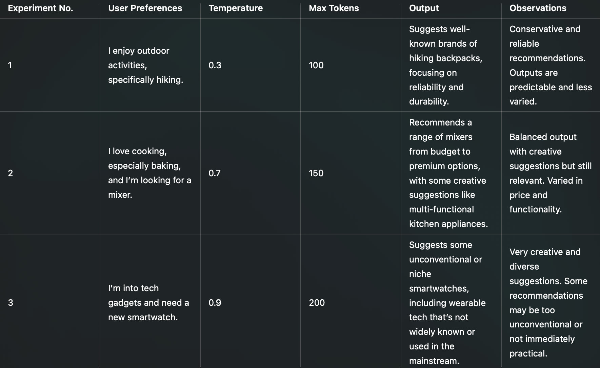

# AI-Powered Product Recommendation Tool

### Project Overview

This project leverages OpenAI’s GPT-3.5-turbo model to generate personalized product recommendations based on user preferences. The tool prompts users for their activities, interests, and needs, then generates relevant product suggestions. This project explores the capabilities of language models in providing customized recommendations, similar to those used in real-world e-commerce platforms.

### Features

	•	Interactive User Input: Collects user preferences through a simple interface.
	•	AI-Powered Recommendations: Generates product suggestions using the OpenAI API.
	•	Customization: Allows adjustments of parameters like temperature to control the creativity of recommendations.
	•	Error Handling: Manages API rate limits and other potential errors gracefully.

### Setup Instructions

1. Prerequisites

	•	Python 3.6+: Ensure Python is installed on your machine.
	•	OpenAI API Key: Obtain an API key by signing up at OpenAI.

2. Clone the Repository

Clone this repository to your local machine:

```
git clone https://github.com/your-username/product-recommendation-tool.git](https://github.com/AlexRibeiro95/LLM-API_Project
cd product-recommendation-tool

```

3. Install Dependencies

Install the required Python packages using pip:

```
pip install openai python-dotenv streamlit

```

4. Set Up Environment Variables

Create a .env file in the project directory and add your OpenAI API key:

```
OPENAI_API_KEY=your-api-key-here
# Replace your-api-key-here with your actual API key.
```
5. Run the Project

To start the tool using Streamlit, run the following command:

```
streamlit run app.py
```

### Usage Instructions

1.	Launch the Tool: Start the Streamlit app using the command above.
2.	Enter Preferences: Provide details about your activities, interests, and the item you are looking for.
3.	Get Recommendations: Click “Get Recommendations” to receive AI-powered product suggestions.
4.	Restart: Use the “Restart” button to reset the input fields and start over.

#### Example:



### Code Explanation

Main Components

•	collect_user_input(): Prompts the user for preferences and combines the inputs into a summary string.
•	generate_product_recommendations(): Interacts with the OpenAI API to generate product suggestions based on user input.
•	Streamlit Interface: Provides an interactive web interface for users to enter preferences and receive recommendations.

Parameters

•	temperature: Controls the creativity of the output. Lower values (e.g., 0.3) produce more predictable results, while higher values (e.g., 0.9) increase creativity.
•	max_tokens: Limits the length of the generated recommendations. Adjust to control detail and verbosity.

### Experimentation and Findings

Experiments were conducted to analyze how different parameters affect the quality of recommendations:

•	Low Temperature: Provided predictable and reliable recommendations.
•	High Temperature: Generated more diverse and creative suggestions, though some were unconventional.

#### Lessons Learned

This project demonstrated the integration of language models via an API, the impact of parameter tuning, and handling API rate limits. Key challenges included managing sensitive data securely and ensuring robust API interactions.

Future Improvements

•	User Interface Enhancements: Develop a more sophisticated UI for better user experience.
•	Feedback Loop: Implement a feedback mechanism for users to rate recommendations, allowing the tool to learn and improve.
•	Expanded Data Sources: Integrate additional data sources, such as product reviews, to enhance recommendation accuracy.

#### Summary

- Project Overview: An introduction to the tool and its purpose.
- Setup and Usage: Instructions for getting the project up and running.
- Code Explanation: A breakdown of the key components and parameters.
- Experimentation: Insights gained from testing and tuning the model.
- Future Improvements: Ideas for extending and improving the tool.


 
